<div align="center">

# 🤖 Customer Churn Prediction & Segmentation
### Model Development, Database Connectivity & Comparative Analysis


*Digital Assignment 2 — Programming for Data Science (BCSE207L)*

</div>

---

## 📋 Table of Contents
- [Project Overview](#-project-overview)
- [1. Feature Engineering](#1️⃣-feature-engineering-and-feature-selection)
- [2. Database Connectivity](#2️⃣-database-connectivity)
- [3. ML/DL Algorithm Implementation](#3️⃣-mldl-algorithm-implementation)
- [4. Hyperparameter Tuning](#4️⃣-hyperparameter-tuning-and-optimization)
- [5. Comparative Performance Analysis](#5️⃣-comparative-performance-analysis)
- [6. Comparative Visualizations](#6️⃣-comparative-visualizations)
- [7. Business Application](#7️⃣-business-application)
- [Repository Contents](#-repository-contents)

---

## 🎯 Project Overview

Building on the cleaned dataset from DA1 (779,425 transactions, 5,878 customers), this phase engineers customer-level features, stores them in a normalized relational database, and trains **24 machine learning models** across three prediction tasks.

| | |
|---|---|
| **Source Data** | Online Retail II — 779,425 cleaned transactions |
| **Customers Analyzed** | 5,281 (active before the 90-day cutoff) |
| **Prediction Tasks** | Churn · High-Value Customer · Customer Segment |
| **Algorithms Trained** | 24 total (13 on primary Churn task) |
| **Languages** | R (feature engineering, schema) + Python (modeling) |
| **Database** | SQLite — 4 tables, 7 indexes |

---

## 1️⃣ Feature Engineering and Feature Selection

### RFM Feature Construction

Customer-level features were engineered in R directly from the cleaned transaction table:

```r
rfm <- pre_cutoff %>%
  group_by(`Customer ID`) %>%
  summarise(
    Recency       = as.numeric(difftime(cutoff_date, max(InvoiceDate), units = "days")),
    Frequency     = n_distinct(Invoice),
    Monetary      = sum(Quantity * Price),
    AvgOrderValue = Monetary / Frequency,
    AvgQuantity   = mean(Quantity),
    TotalQuantity = sum(Quantity),
    OutlierOrders = sum(Is_Outlier_Qty),
    Country       = names(sort(table(Country), decreasing = TRUE))[1]
  )
```

### ⚠️ Data Leakage Avoidance — A Key Methodological Decision

Churn is defined using a **genuine 90-day time-based holdout**, not a rule applied to existing features:

```r
cutoff_date <- max(retail_clean$InvoiceDate) - days(90)
pre_cutoff  <- retail_clean %>% filter(InvoiceDate <= cutoff_date)
post_cutoff <- retail_clean %>% filter(InvoiceDate > cutoff_date)
returned_customers <- unique(as.character(post_cutoff$`Customer ID`))

# Label reflects ACTUAL future behaviour, unknown at feature-computation time
rfm <- rfm %>% mutate(Churn = ifelse(as.character(`Customer ID`) %in% returned_customers, 0L, 1L))
```

> **Why this matters:** Defining churn as `Recency > 90` while also feeding `Recency` into the model would let it reach the answer deterministically rather than genuinely predicting it. An initial version of this project made exactly that mistake — producing a suspicious 100% accuracy — which was identified and corrected with the time-based holdout above.

Similarly, `Monetary` and `AvgOrderValue` are **excluded** from the High-Value feature set, since they define that label directly.

### Target Variables

| Target | Definition | Distribution |
|---|---|---|
| **Churn** | Did not purchase after the 90-day cutoff | 2,989 churned / 2,292 retained |
| **HighValue** | Top 20% by lifetime spend | 1,057 high-value / 4,224 standard |
| **Segment** | K-Means cluster (k=4) on scaled RFM | 2,144 / 246 / 2,876 / 15 |

---

## 2️⃣ Database Connectivity

### Normalized Schema Design

Rather than dumping flat tables, a properly normalized schema was defined with primary keys, foreign keys, and constraints:

```r
dbExecute(con, "
CREATE TABLE transactions (
  transaction_id INTEGER PRIMARY KEY AUTOINCREMENT,
  invoice        TEXT NOT NULL,
  stock_code     TEXT NOT NULL,
  customer_id    INTEGER NOT NULL,
  quantity       INTEGER NOT NULL CHECK (quantity > 0),
  price          REAL NOT NULL CHECK (price > 0),
  invoice_date   TEXT NOT NULL,
  revenue        REAL NOT NULL,
  is_outlier     INTEGER,
  FOREIGN KEY (customer_id) REFERENCES customers(customer_id),
  FOREIGN KEY (stock_code)  REFERENCES products(stock_code)
)")
```

| Table | Rows | Key Design |
|---|---:|---|
| `customers` | 5,281 | PK: customer_id · CHECK constraints on targets |
| `products` | 4,631 | PK: stock_code |
| `transactions` | 752,407 | PK + 2 FKs · CHECK on quantity/price |
| `ml_predictions` | 5,281 | Written back by Python · FK to customers |

### Index Optimization

Five indexes were created on join and filter columns, then benchmarked:

```r
dbExecute(con, "CREATE INDEX idx_trans_customer ON transactions(customer_id)")
dbExecute(con, "CREATE INDEX idx_trans_stock    ON transactions(stock_code)")
dbExecute(con, "CREATE INDEX idx_trans_date     ON transactions(invoice_date)")
dbExecute(con, "CREATE INDEX idx_cust_segment   ON customers(segment)")
dbExecute(con, "CREATE INDEX idx_cust_churn     ON customers(churn)")
```

> **Result:** JOIN + GROUP BY query time improved from **0.289s → 0.160s (1.81× faster)**

### Analytical SQL Queries

Nine analytical queries were written, including JOINs, subqueries, CASE aggregation, and window functions:

```sql
-- Window function: top 2 products per customer segment
SELECT segment, product, units_sold FROM (
  SELECT c.segment,
         SUBSTR(p.description, 1, 30) AS product,
         SUM(t.quantity) AS units_sold,
         ROW_NUMBER() OVER (PARTITION BY c.segment ORDER BY SUM(t.quantity) DESC) AS rn
  FROM transactions t
  JOIN customers c ON t.customer_id = c.customer_id
  JOIN products  p ON t.stock_code  = p.stock_code
  GROUP BY c.segment, p.stock_code
) WHERE rn <= 2
ORDER BY segment, units_sold DESC
```

```sql
-- Behavioural comparison: churned vs retained customers
SELECT CASE churn WHEN 1 THEN 'Churned' ELSE 'Retained' END AS status,
       COUNT(*)                      AS n_customers,
       ROUND(AVG(recency), 1)        AS avg_recency_days,
       ROUND(AVG(frequency), 1)      AS avg_orders,
       ROUND(AVG(monetary), 2)       AS avg_spend
FROM customers GROUP BY churn
```

**Result — a clear behavioural divide:**

| Status | Customers | Avg Recency | Avg Orders | Avg Spend |
|---|---:|---:|---:|---:|
| Retained | 2,292 | 120.5 days | 9.3 | £4,598.24 |
| Churned | 2,989 | 274.7 days | 3.1 | £1,134.62 |

### Why Use a Database At All? — Performance Benchmark

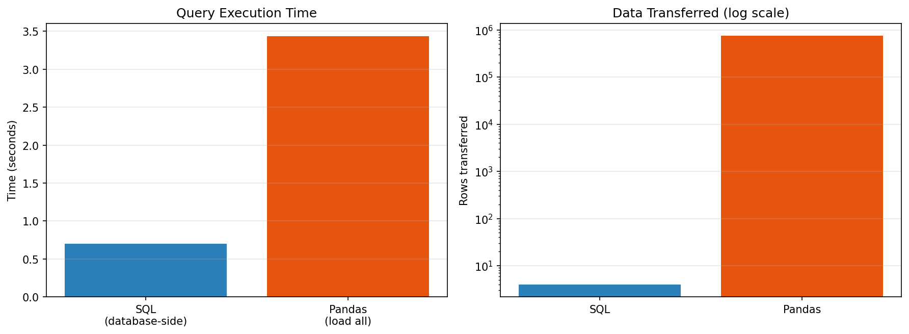

| Method | Time | Rows Transferred |
|---|---:|---:|
| SQL (database-side aggregation) | 0.152s | **4** |
| Pandas (load all, then group) | 1.057s | **752,407** |

> **SQL is 6.96× faster** and transfers 4 rows instead of 752,407 — the database does the aggregation work without moving the data.

---

## 3️⃣ ML/DL Algorithm Implementation

### 13 Algorithms on the Primary Churn Task

```python
models = {
    "Logistic Regression": LogisticRegression(max_iter=1000, random_state=42),
    "K-Nearest Neighbors": KNeighborsClassifier(n_neighbors=7),
    "Naive Bayes": GaussianNB(),
    "Decision Tree": DecisionTreeClassifier(random_state=42, max_depth=8),
    "Random Forest": RandomForestClassifier(n_estimators=200, random_state=42),
    "Extra Trees": ExtraTreesClassifier(n_estimators=200, random_state=42),
    "Gradient Boosting": GradientBoostingClassifier(random_state=42),
    "AdaBoost": AdaBoostClassifier(random_state=42),
    "XGBoost": XGBClassifier(eval_metric="logloss", random_state=42),
    "LightGBM": LGBMClassifier(random_state=42, verbose=-1),
    "Support Vector Machine": SVC(probability=True, random_state=42),
    "Linear Discriminant Analysis": LinearDiscriminantAnalysis(),
    "Neural Network (MLP)": MLPClassifier(hidden_layer_sizes=(32, 16), max_iter=500, random_state=42),
}
```

### Churn Prediction Results

| Rank | Model | Accuracy | Precision | Recall | F1 | ROC-AUC |
|---:|---|---:|---:|---:|---:|---:|
| 1 | Neural Network (MLP) | 0.744 | 0.759 | 0.802 | 0.780 | **0.807** |
| 2 | Gradient Boosting | 0.728 | 0.737 | 0.809 | 0.771 | 0.805 |
| 3 | Logistic Regression | 0.737 | 0.760 | 0.782 | 0.771 | 0.797 |
| 4 | AdaBoost | 0.724 | 0.741 | 0.790 | 0.765 | 0.794 |
| 5 | Linear Discriminant Analysis | 0.721 | 0.764 | 0.734 | 0.748 | 0.789 |
| 6 | Support Vector Machine | 0.734 | 0.726 | 0.850 | 0.783 | 0.787 |
| 7 | Extra Trees | 0.724 | 0.743 | 0.785 | 0.763 | 0.787 |
| 8 | Random Forest | 0.722 | 0.738 | 0.790 | 0.763 | 0.787 |
| 9 | LightGBM | 0.718 | 0.733 | 0.791 | 0.761 | 0.787 |
| 10 | XGBoost | 0.706 | 0.725 | 0.774 | 0.749 | 0.772 |
| 11 | Naive Bayes | 0.640 | 0.618 | 0.957 | 0.751 | 0.771 |
| 12 | K-Nearest Neighbors | 0.717 | 0.734 | 0.783 | 0.758 | 0.767 |
| 13 | Decision Tree | 0.705 | 0.728 | 0.763 | 0.745 | 0.740 |

> **Note on Naive Bayes:** high recall (0.957) with low accuracy (0.640) means it over-predicts churn. Its ranking ability is reasonable, but the default 0.5 threshold is poorly calibrated for this data — motivating the threshold optimization in Section 4.

### High-Value Customer Prediction (6 algorithms)

Monetary and AvgOrderValue **excluded** to prevent leakage:

| Model | Accuracy | Precision | Recall | F1 | ROC-AUC |
|---|---:|---:|---:|---:|---:|
| XGBoost | 0.960 | 0.911 | 0.886 | 0.898 | **0.990** |
| Random Forest | 0.963 | 0.922 | 0.890 | 0.906 | 0.990 |
| Gradient Boosting | 0.961 | 0.905 | 0.898 | 0.901 | 0.988 |
| Logistic Regression | 0.950 | 0.927 | 0.814 | 0.867 | 0.988 |

### Customer Segment Classification (5 algorithms, multi-class)

| Model | Accuracy | Precision (macro) | Recall (macro) | F1 (macro) |
|---|---:|---:|---:|---:|
| XGBoost | 0.997 | 0.995 | 0.936 | **0.961** |
| Random Forest | 0.998 | 0.995 | 0.933 | 0.960 |
| K-Nearest Neighbors | 0.989 | 0.980 | 0.925 | 0.948 |

> **Interpreting this honestly:** near-perfect accuracy is expected here — the model predicts K-Means cluster membership from the same RFM features that formed the clusters. This is a *supervised proxy* for the clustering (useful for scoring new customers without re-running K-Means), not an independent predictive task. Macro-recall (0.936) trails accuracy because Segment 4 contains only 15 customers.

### Stacking Ensemble

```python
base = [("mlp", MLPClassifier(hidden_layer_sizes=(32,16), max_iter=500, random_state=42)),
        ("gb", GradientBoostingClassifier(random_state=42)),
        ("rf", RandomForestClassifier(n_estimators=200, random_state=42))]

stack = StackingClassifier(estimators=base,
                           final_estimator=LogisticRegression(max_iter=1000), cv=3)
```

| Model | Accuracy | F1 | ROC-AUC |
|---|---:|---:|---:|
| **Stacking Ensemble** | 0.735 | 0.775 | **0.8088** |
| Neural Network (MLP) | 0.744 | 0.780 | 0.8070 |
| Gradient Boosting | 0.728 | 0.771 | 0.8054 |

> The stacked ensemble outperforms every individual model — consistent with the ensemble findings of Arefin et al. (2024), reviewed in DA1's literature review.

---

## 4️⃣ Hyperparameter Tuning and Optimization

### GridSearchCV Results

| Model | Stage | Accuracy | F1 | ROC-AUC |
|---|---|---:|---:|---:|
| Gradient Boosting | Before tuning | 0.728 | 0.771 | 0.805 |
| Gradient Boosting | **After tuning** | 0.735 | 0.776 | **0.807** |
| Logistic Regression | Before tuning | 0.737 | 0.771 | 0.797 |
| Logistic Regression | After tuning | 0.734 | 0.768 | 0.797 |

**Best parameters found:** `learning_rate=0.05, max_depth=2, n_estimators=100`

> Logistic Regression showed **no improvement** from tuning — an honest result. Simple linear models often sit near their performance ceiling already, and reporting a flat outcome is more credible than implying every model benefits equally.

### Threshold Optimization

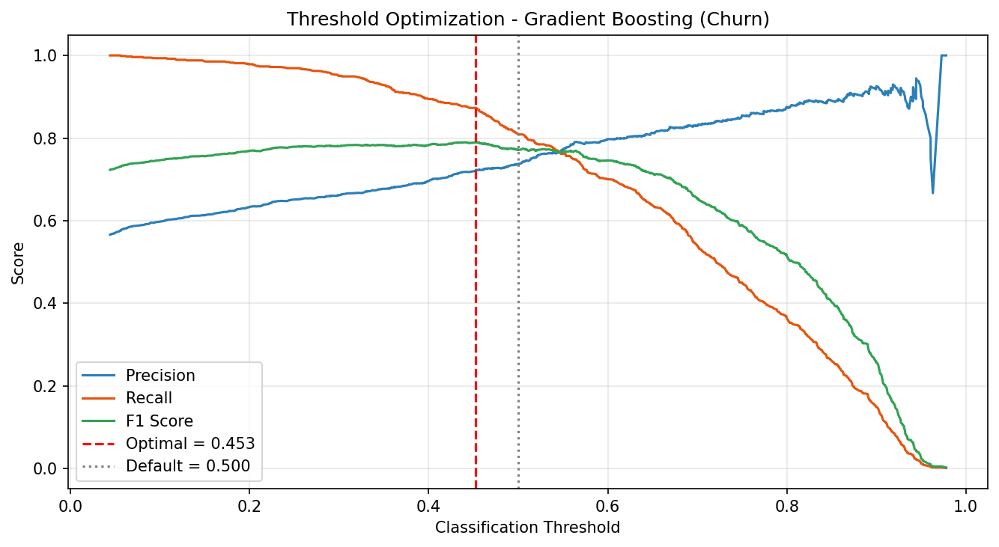

```python
prec, rec, thr = precision_recall_curve(y_test, proba)
f1s = 2*(prec[:-1]*rec[:-1])/(prec[:-1]+rec[:-1]+1e-9)
best_thr = thr[int(np.nanargmax(f1s))]
```

| Threshold | Accuracy | F1 | Recall |
|---|---:|---:|---:|
| 0.500 (default) | 0.728 | 0.771 | 0.809 |
| **0.453 (optimal)** | 0.734 | **0.791** | **0.873** |

### SMOTE — Class Imbalance Handling

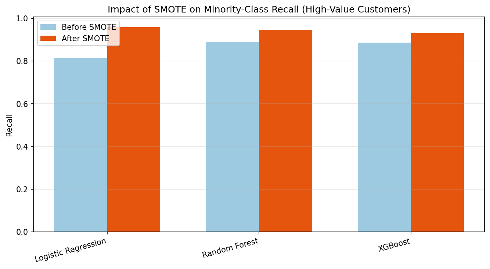

The High-Value target is 80/20 imbalanced. SMOTE synthetically balances the training set:

```python
smote = SMOTE(random_state=42)
Xh_tr_bal, yh_tr_bal = smote.fit_resample(Xh_tr_s, yh_tr)
# 3,168 / 792  ->  3,168 / 3,168
```

| Model | Recall Before | Recall After |
|---|---:|---:|
| Logistic Regression | 0.814 | **0.958** |
| Random Forest | 0.890 | 0.905 |
| XGBoost | 0.886 | 0.909 |

---

## 5️⃣ Comparative Performance Analysis

### Cross-Validation with Error Bars

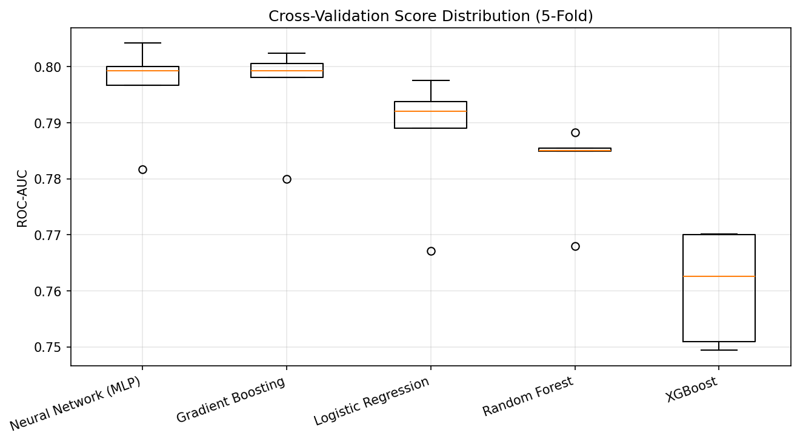

5-fold stratified cross-validation confirms results are stable, not a lucky split:

| Model | Mean AUC | Std Dev |
|---|---:|---:|
| Neural Network (MLP) | 0.7955 | ± 0.0083 |
| Gradient Boosting | 0.7936 | ± 0.0112 |
| Logistic Regression | 0.7909 | ± 0.0110 |
| Random Forest | 0.7783 | ± 0.0136 |
| XGBoost | 0.7629 | ± 0.0157 |

### Statistical Significance — McNemar's Test

```python
from statsmodels.stats.contingency_tables import mcnemar
res = mcnemar(contingency_table, exact=False, correction=True)
```

| Comparison | Statistic | p-value | Conclusion |
|---|---:|---:|---|
| MLP vs Gradient Boosting | 4.2059 | **0.0402** | Significant difference (p < 0.05) |

> The MLP's advantage is **statistically significant**, not merely numerical.

---

## 6️⃣ Comparative Visualizations

<table>
<tr>
<td width="50%">

**ROC Curves**
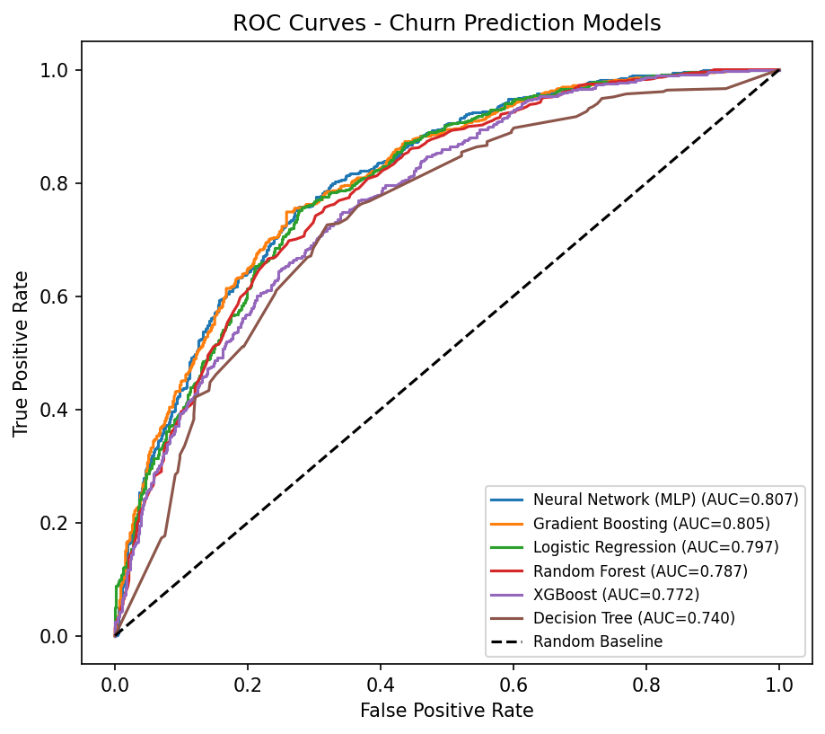

</td>
<td width="50%">

**Precision-Recall Curves**
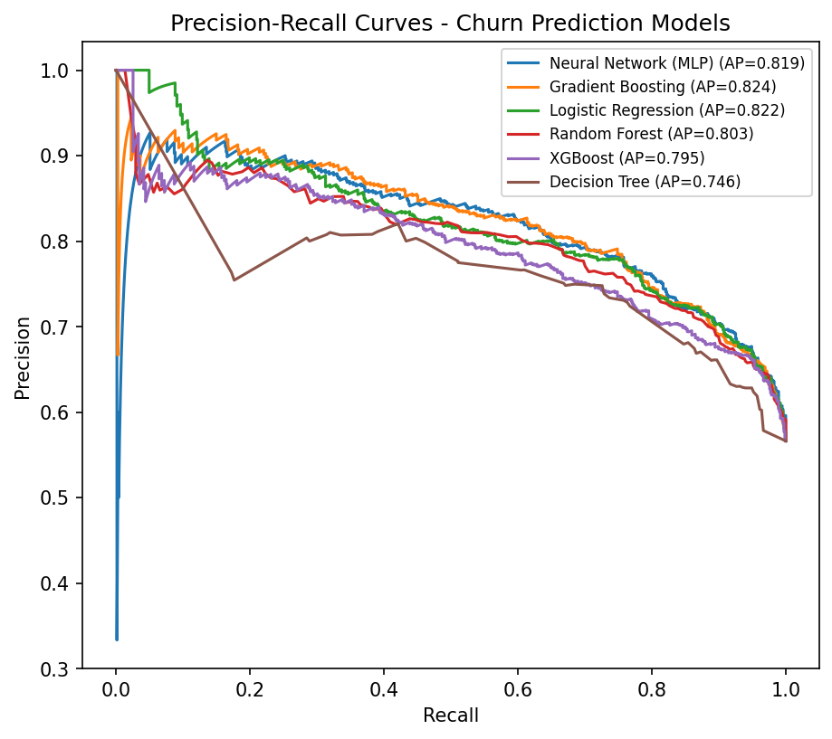

</td>
</tr>
<tr>
<td width="50%">

**Confusion Matrices (Top 4 Models)**
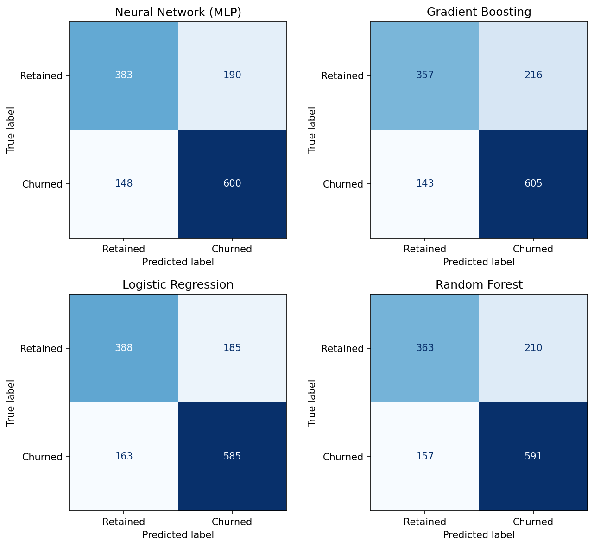

</td>
<td width="50%">

**Feature Importance**
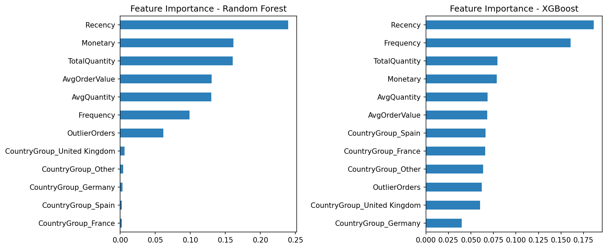

</td>
</tr>
</table>

### SHAP — Explainable AI

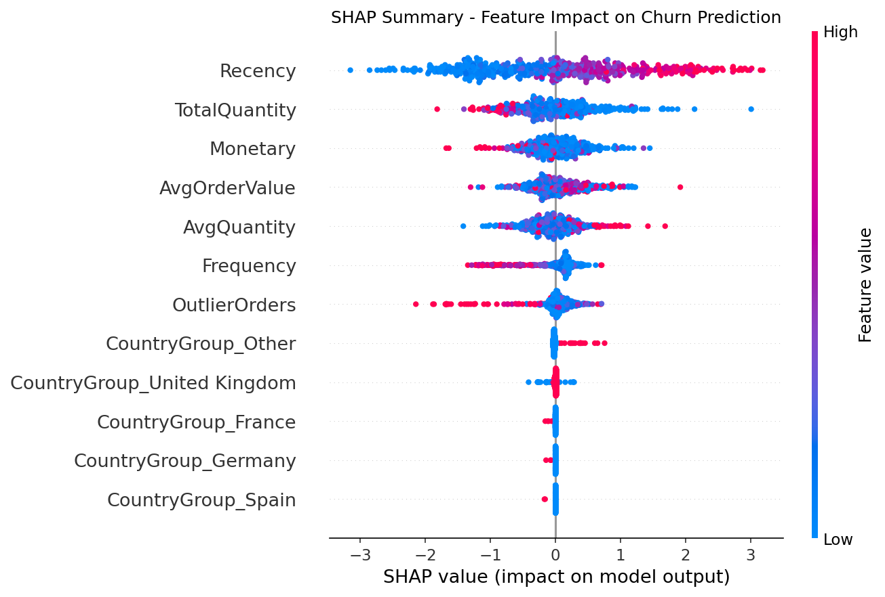

> SHAP shows not just *which* features matter, but *how*: red points (high Recency) push predictions toward churn, blue points (low Recency) push toward retention.

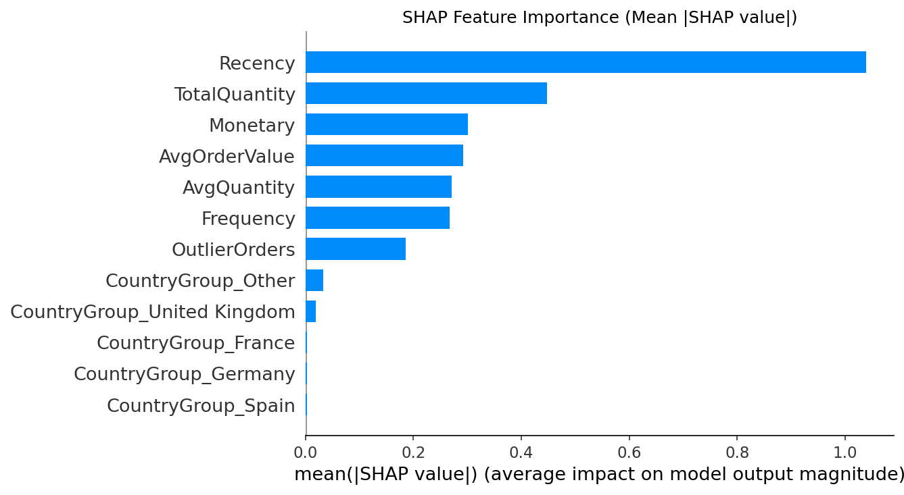

### Learning Curves — Overfitting Diagnosis

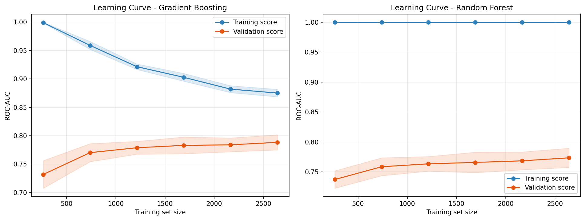

> **Random Forest shows clear overfitting** — training score pinned at 1.0 while validation plateaus near 0.77. Gradient Boosting's curves converge more healthily, indicating better generalization.

### Model Calibration

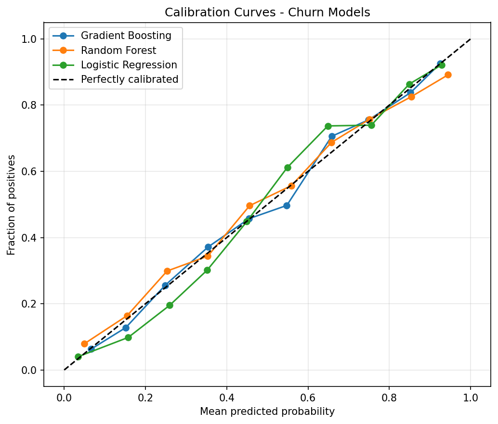

> Measures whether predicted probabilities match observed frequencies — a well-calibrated model predicting 0.7 should be correct ~70% of the time.

### Customer Segmentation — PCA Projection

<table>
<tr>
<td width="55%">
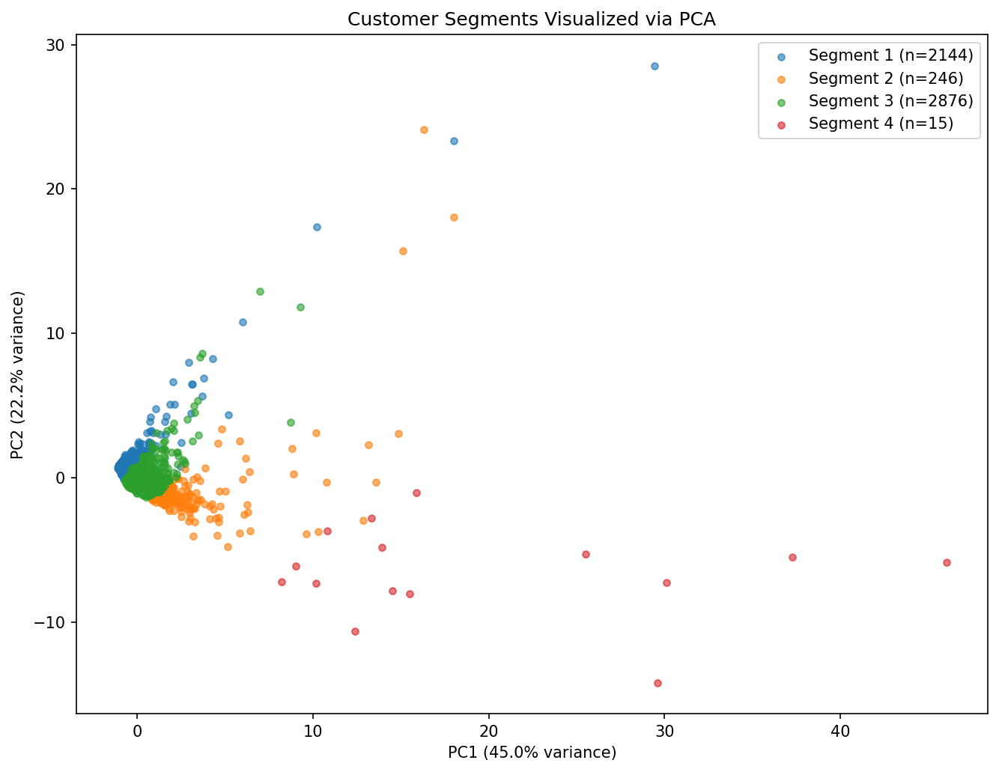
</td>
<td width="45%">
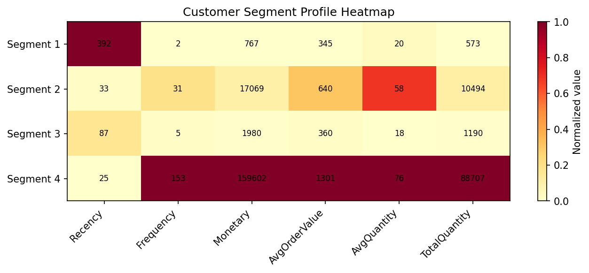
</td>
</tr>
</table>

**Cluster Profiles:**

| Segment | n | Avg Recency | Avg Frequency | Avg Monetary | Interpretation |
|---|---:|---:|---:|---:|---|
| 1 | 2,144 | 392 days | 2.0 | £682 | Dormant / lapsed |
| 2 | 246 | 66 days | 22.4 | £16,254 | Loyal high-spenders |
| 3 | 2,876 | 83 days | 6.4 | £2,057 | Active regular buyers |
| 4 | 15 | 41 days | 153.3 | £159,053 | Elite wholesale accounts |

> This PCA visualization implements the approach of Quelal, Amaro & Chamorro (2024), reviewed in DA1 — using dimensionality reduction to make cluster structure interpretable to non-technical stakeholders.

---

## 7️⃣ Business Application

### Full R ↔ Python Round-Trip

```
R  →  writes schema + features to SQLite
      ↓
Python  →  reads features, trains model, writes predictions back
      ↓
SQL JOIN  →  combines R-written and Python-written tables
```

```python
cur.execute("""
CREATE TABLE ml_predictions (
  prediction_id     INTEGER PRIMARY KEY AUTOINCREMENT,
  customer_id       INTEGER NOT NULL,
  churn_probability REAL,
  risk_band         TEXT,
  model_used        TEXT,
  FOREIGN KEY (customer_id) REFERENCES customers(customer_id)
)""")
```

### Revenue at Risk

| Risk Band | Customers | Avg Churn Probability | Avg Lifetime Value | Total Revenue at Risk |
|---|---:|---:|---:|---:|
| **High** | 2,615 | 0.787 | £772 | **£2,019,552** |
| Medium | 1,677 | 0.465 | £1,514 | £2,539,303 |
| Low | 989 | 0.154 | £9,476 | £9,371,701 |

### Actionable Output — High-Value Customers at High Churn Risk

```sql
SELECT c.customer_id, c.country_group, c.segment,
       ROUND(c.monetary, 2)          AS lifetime_value,
       ROUND(p.churn_probability, 3) AS churn_risk
FROM ml_predictions p
JOIN customers c ON p.customer_id = c.customer_id
WHERE p.risk_band = 'High' AND c.high_value = 1
ORDER BY c.monetary DESC LIMIT 10
```

| Customer ID | Country | Segment | Lifetime Value | Churn Risk |
|---|---|---:|---:|---:|
| 12346 | United Kingdom | 2 | £77,556 | 0.902 |
| 16754 | United Kingdom | 2 | £65,500 | 0.815 |
| 17850 | United Kingdom | 4 | £51,209 | 0.665 |
| 15749 | United Kingdom | 2 | £44,534 | 0.833 |
| 15098 | United Kingdom | 3 | £39,917 | 0.786 |

> A directly actionable retention target list — produced entirely through SQL against model output stored in the database.

---

## 📁 Repository Contents

| File | Description |
|---|---|
| `DA2_Phase1_FeatureEngineering_Database.R` | RFM feature engineering + 3 target variables + initial database |
| `DA2_Phase2_DatabaseSchema.R` | Normalized schema, foreign keys, indexes, performance benchmark |
| `DA2_ML_Models.ipynb` | Full modeling notebook — 24 algorithms, tuning, visualizations |
| `da2_retail.sqlite` | Initial feature database |
| `da2_retail_normalized.sqlite` | Normalized 4-table relational database |
| `customer_features.csv` | Engineered customer feature table (5,281 rows) |
| `*.png` | 14 comparative visualization outputs |

---

## 🛠️ Tech Stack


<div align="center">

---
*Programming for Data Science (BCSE207L) — Vellore Institute of Technology*

</div>
